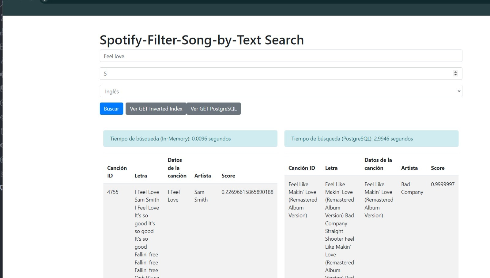
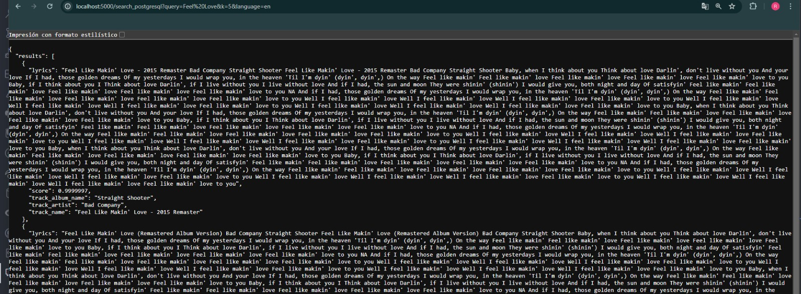

# Búsqueda y Recuperación de la Información 
#### Integrantes: Ricardo Acuña, Gonzalo Perea, Isabella Romero, Rodrigo Lauz y Josué Velo

## Introducción
### Objetivo del proyecto
Este proyecto fue desarrollado con el fin de facilitar la búsqueda de canciones a través de palabras específicas, como por ejemplo las top 10 canciones más relacionadas al amor o tristeza. Esto simpilifica y devuelve los resultados más acorde a lo que buscamos en un tiempo mínimo.

### Descripción del dominio de datos y la importancia de aplicar indexación
La base de datos contiene más de 17 mil registros de canciones con especificaciones como: nombre, artista, letra de la canción, popularidad, nombre del album, fecha de lanzamiento, género, instrumentos, etc. De las cuales, estamos usando principalmente las columnas del artista, nombre y letra de la canción para poder ingresar un conjunto de palabras y que devuelva las top k canciones que se relacionan más a las palabras ingresadas.
Es importante utilizar índices, ya que minimiza el tiempo de búsqueda de similitud en cantidades masivas de registros como en este caso. En lugar de iterar uno por uno, se genera una lista de palabras clave que estan relacionadas con cierto puntaje a cada canción. Luego este proceso será explicado más a fondo.

## Backend: Índice Invertido
### Construcción del índice invertido en memoria secundaria
Para construir un índice invertido en memoria secundaria, hemos utilizado una lógica basada en el tamaño de los bloques. Asumiendo un tamaño de bloque de 4096 bytes y considerando que para cada término guardamos su `doc_id` y su valor de `tf-idf`, estamos almacenando 8 bytes por registro (4 bytes para `doc_id` y 4 bytes para `tf-idf`). Esto permite almacenar hasta 4096 registros por bloque, con un total de 32,768 bytes por bloque. Si limitamos la construcción del índice invertido a usar 1MB de RAM, podemos calcular el número de índices invertidos locales como $\frac{1024 \times 1024}{4096 \times 8}$, lo que da aproximadamente 32 índices invertidos locales. Sin embargo, en la práctica, los registros pueden ocupar más espacio. Por ejemplo, si cada término aparece en 4 documentos y almacenamos 4 valores de `tf-idf` por término, el tamaño por registro sería 32 bytes (4 `doc_ids` y 4 `tf-idf`). Si limitamos la RAM a 4MB, el cálculo sería $\frac{4 \times 1024 \times 1024}{4096 \times 32}$, lo que también da aproximadamente 32 índices invertidos locales. Esto implica que un término puede aparecer en más de un índice invertido si alcanza el límite de tamaño del bloque.

### Ejecución óptima de consultas aplicando Similitud de Coseno
La similitud de coseno es una medida fundamental para comparar la similitud entre distintos archivos, en este caso, canciones. Se utiliza para calcular qué tan cercanas son dos canciones en términos de contenido, mediante la representación de cada canción como un vector de características basado en términos relevantes ponderados (como TF-IDF). Al aplicar la fórmula del coseno entre estos vectores, se obtiene un valor que indica la proximidad entre las canciones: valores cercanos a 1 denotan alta similitud, mientras que cercanos a 0 indican diferencias significativas. Esto permite realizar recomendaciones de canciones similares y agrupar por temas líricos comunes dentro de la base de datos musical de manera eficiente y precisa.

### Construcción del índice invertido en PostgreSQL
En PostgreSQL, la técnica para aplicar el índice invertido se denomina GIN (Generalized Inverted Index). GIN está diseñado para trabajar con valores compuestos, permitiendo la combinación de múltiples celdas en un solo índice. 
En este caso, los elementos del índice son archivos y las consultas son palabras o términos que queremos buscar en estos archivos específicos. El índice GIN almacena pares de clave (key) y postings lists, donde cada una es un conjunto de identificadores de filas (row IDs) correspondientes a los documentos en los que aparece la clave.

La estructura interna del índice GIN en PostgreSQL es un B-tree para almacenar claves (keys) y sus posting lists, lo que permite búsquedas eficientes en documentos textuales.

Cada clave se almacena solo una vez, haciendo el índice compacto. Los índices GIN multicolumna combinan valores de diferentes columnas en un solo B-tree. Esta estructura soporta consultas complejas y permite el desarrollo de tipos de datos personalizados, mejorando la eficiencia y rapidez de las búsquedas de texto completo.

Cuando se realiza una consulta que contiene múltiples términos (usando AND), PostgreSQL busca los documentos que contienen todos los términos especificados. Esto se hace combinando las listas de postings de cada término.

## Frontend
Tenemos opción para colocar idioma y el valor de k para hayar los top k más relacionados.
Te devuelve el ID de la canción, nombre, lyrics, artista y score de similitud.

### Índice invertido vs GiN PostgreSQL
Nuestro frontend muestra no solo los datos obtenidos usando nuestro índice invertido, también los del índice GiN en postgresql, además se puede visualizar estos mismos datos en formato json.

## Experimentación
### Tablas y gráficos de los resultados experimentales
#### Query: "Feel Love"

#### Query: "Roar"

<https://docs.google.com/spreadsheets/d/1Hz1B3FfuxvhOOhrPeBV6ze1CJF0ue693COQl0Q4s_Cs/edit?usp=sharing>

### Análisis y discusión
Al investigar cómo funciona el índice GIN en PostgreSQL, notamos que este trabaja con el operador AND, realizando una intersección de palabras en las consultas. Por ejemplo, devuelve resultados de canciones que contengan tanto la palabra "feel" como "love", lo que incrementa el tiempo de búsqueda. Por otro lado, nuestro índice invertido utiliza el operador OR, lo que resulta en tiempos de búsqueda mucho menores, ya que realiza una unión y devuelve todas las canciones que contienen la palabra "feel" o "love". En términos de efectividad, ambos índices son útiles; el de PostgreSQL es más efectivo para encontrar coincidencias exactas en una oración o una frase compuesta, mientras que para búsquedas de palabras individuales, ambos métodos son igualmente efectivos.

Las similitudes cosenos implementadas son muy diferentes, y el factor principal de esto es la `metadata`, un motor de búsqueda de canciones como spotify se rige por el nombre del artista o el nombre de la canción, y el peso que tengan los keywords en ello deberían ser por obvias razones mayor que cualquier otro keyword que aparezca en las líricas de una canción, en caso contrario de un motor de búsqueda de papers donde sí se muestra más ese balance entre frecuencia de keywords y rareza de estos (`tf-idf`), es por ello la diferencia notoria en los score entre ambos índices.

El normalizar los vectores en la implementación de nuestro índice, ayuda a equilibrar las frecuencias de las palabras clave y asegurar que los resultados sean más consistentes y rápidos. PostgreSQL podría no estar normalizando en la misma medida, lo que puede generar variaciones significativas en los scores y, consecuentemente, en los tiempos de búsqueda dependiendo de la consulta. El no normalizar (en el caso del índice GIN) podría generar un desbalance entre la frecuencia y la rareza de los keywords, en consecuencia, una gran diferencia en los scores obtenidos dependiendo de la query (obteniendo scores muy altos o scores muy bajos).
